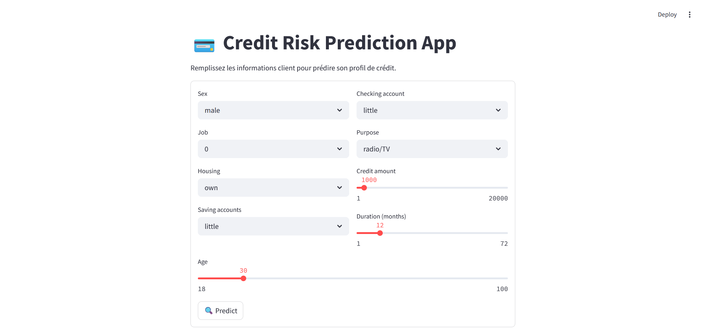
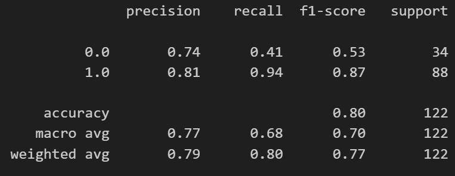
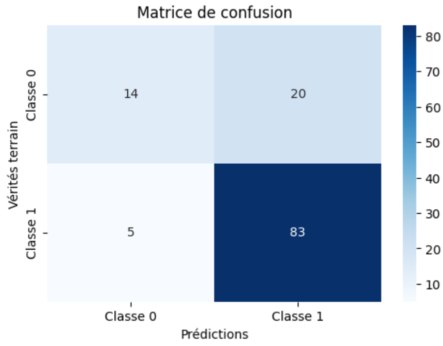
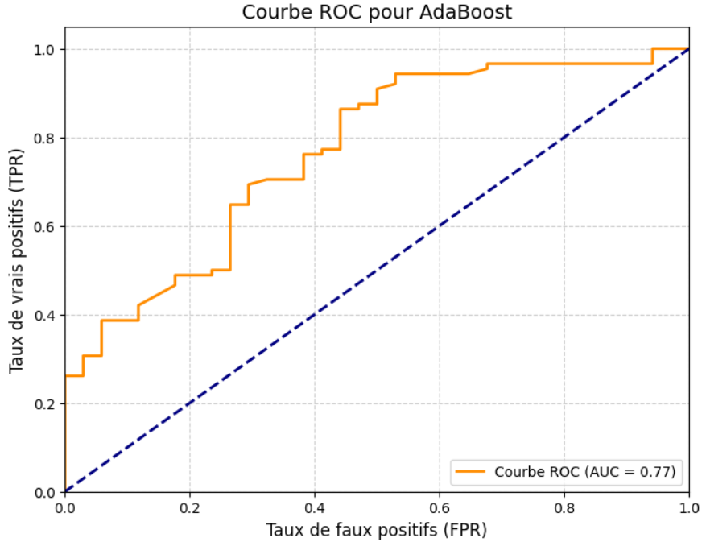

# 💳 Credit Risk Prediction App

This project is a **credit risk prediction model** that helps assess whether a client is likely to repay a loan or not. The target variable classifies clients as either **"good"** or **"bad"**, which helps financial institutions decide:

- whether to approve a loan
- whether to grant the full amount
- or to reject the loan in extreme risk cases.

## 🧠 Modeling Process

Implemented and analyzed in a Jupyter Notebook (on VS Code):

- Visualized and explored the dataset (`german_credit_data.csv`)
- Handled missing values and performed preprocessing:
  - Label Encoding for categorical variables
  - Standard Scaling for numerical features
- Trained several classification models:
  - Logistic Regression
  - Random Forest Classifier
  - K-Nearest Neighbors
  - Voting Classifier
  - **AdaBoost Classifier (best performing)**

The best model (`AdaBoostClassifier`) was saved using `joblib` along with the required preprocessing objects (encoders, scaler, feature lists).

## 🌐 Web App

An interactive and professional web application is developed using **Streamlit**. Users can enter client information to instantly get a prediction on credit risk.

  

## 📈 Model Performance

Here are the evaluation results on the test set:

  
  
  

## 📁 Repository Structure

credit-risk-app/ ├── app.py # Streamlit App ├── notebook/ # Notebook for modeling ├── data/ # Raw data ├── model/ # Trained model and preprocessing objects ├── assets/ # UI and performance visuals ├── requirements.txt # Libraries to install └── README.md # Project documentation

## 🔧 Installation & Usage

1. Clone the repo
2. Install requirements  
   `pip install -r requirements.txt`
3. Run the app  
   `streamlit run app.py`

## 🤝 Author

Sami Ramzi Rezig – Data Science & AI Student  
This project is a practical application of credit risk scoring and model deployment.